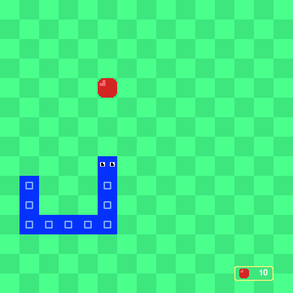

# Snake Game
Classic snake game made with python 3.8 and pygame 1.9.6

|  |  |
| --- | --- |
| Name | Snake Game |
| Made in | March 2021 |
| Language used | Python 3 |
| Libraries used | Pygame, random |
| Programs used | VSCode, GIMP, FL Studio |

## How tu use
Using the `wasd` keys, you can move the snake.

You can see your current score in the bottom right corner.

After a eventual game over, pressing the `spacebar` will restart the game.

---

All code and midia was made by me.
